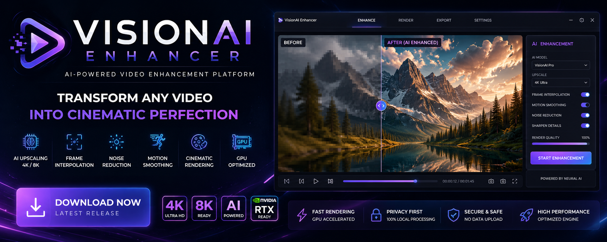

# VisionAI-Enhancer
Advanced AI-powered video enhancement platform with realtime upscaling, cinematic rendering and neural frame interpolation.

<p align="center">
  
</p>

# VISIONAI ENHANCER

### AI-POWERED VIDEO UPSCALING PLATFORM

<div align="center">


# QUICK START

```bash
1. Download latest release
2. Extract archive
3. Launch VisionAI.exe
4. Import video
5. Start AI enhancement
```

# ► [DOWNLOAD NOW](../../releases/latest)

<br><br>

# ► [DOWNLOAD LATEST RELEASE](../../releases/latest)

### Cinematic AI Video Enhancement Engine

# SYSTEM STATUS

```diff
+ AI Engine Online
+ RTX Rendering Enabled
+ Motion Analysis Active
+ Neural Upscaling Ready
+ GPU Acceleration Connected
```

</div>

---

# OVERVIEW

VISIONAI ENHANCER is an advanced neural video enhancement platform designed for cinematic upscaling, frame interpolation and AI-powered video restoration.

The platform combines:

* AI upscaling
* realtime rendering
* frame interpolation
* motion smoothing
* noise reduction
* cinematic enhancement

inside one high-performance desktop interface.

---

# PLATFORM PREVIEW

<p align="center">
  
</p>

---

# CORE FEATURES

| Feature             | Description                |
| ------------------- | -------------------------- |
| AI Upscaling        | Neural video enhancement   |
| Frame Interpolation | Smooth FPS generation      |
| Noise Reduction     | Cleaner image quality      |
| Motion Analysis     | Smart frame reconstruction |
| Cinematic Rendering | Improved visual depth      |
| GPU Optimization    | Fast processing            |

# RENDER PERFORMANCE

```ini
[Performance]
GPU_Acceleration=Enabled
RealtimeProcessing=True
VRAM_Usage=Optimized
RenderMode=Cinematic
AI_Threads=32
```

---

# QUICK START

```bash
1. Download latest release
2. Extract archive
3. Launch VisionAI.exe
4. Import video
5. Start AI enhancement
```

# ► [DOWNLOAD NOW](../../releases/latest)

---

# LIVE CONFIG

```json
{
  "upscaling": "4K",
  "frame_interpolation": true,
  "motion_smoothing": true,
  "noise_reduction": true,
  "gpu_acceleration": true
}
```

---

# AI ENGINE

```python
class VisionAI:

    def upscale_video(self):
        return "4K Enhancement Active"

    def interpolate_frames(self):
        return "Motion Smoothing Enabled"

    def optimize_render(self):
        return "GPU Optimization Running"
```

---

# PERFORMANCE

```ini
[Performance]
GPU_Acceleration=Enabled
RealtimeProcessing=True
MemoryUsage=Optimized
RenderMode=Cinematic
Latency=Low
```

---

# SUPPORTED FORMATS

| Format | Support |
| ------ | ------- |
| MP4    | ✅       |
| MOV    | ✅       |
| MKV    | ✅       |
| AVI    | ✅       |
| WEBM   | ✅       |

---

# ROADMAP

* 8K AI upscaling
* RTX rendering
* HDR enhancement
* Batch rendering
* Cloud processing

---

# DOWNLOAD

<div align="center">

# ► [DOWNLOAD NOW](../../releases/latest)

</div>

---

# DISCLAIMER

This project is intended for video enhancement and research purposes.
